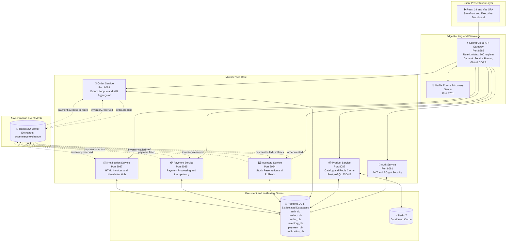
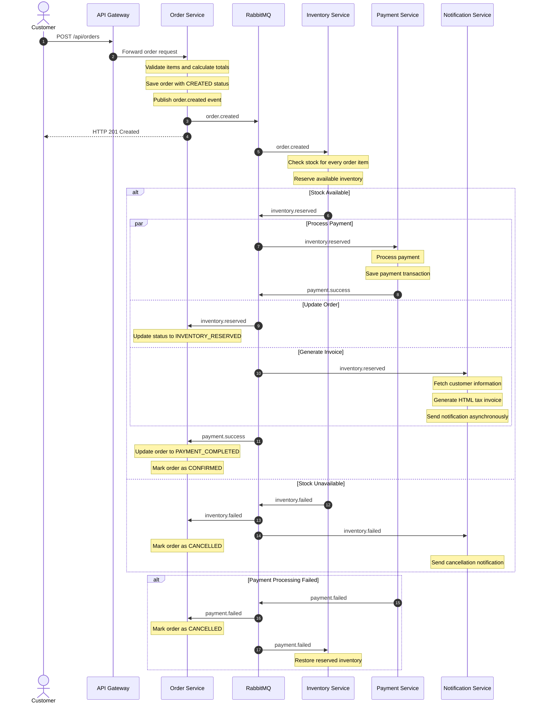

# 🎧 AudioHub: Event-Driven Microservices E-Commerce Platform & Executive Dashboard

[](https://openjdk.org/)
[](https://spring.io/projects/spring-boot)
[](https://spring.io/projects/spring-cloud)
[](https://www.rabbitmq.com/)
[](https://redis.io/)
[](https://cloud.spring.io/spring-cloud-netflix/)
[](https://www.postgresql.org/)
[](https://react.dev/)
[](https://tailwindcss.com/)
[](https://www.docker.com/)

**AudioHub** is an enterprise-grade, event-driven e-commerce platform and executive management dashboard designed for audiophile equipment including Headphones, IEMs, Studio Monitors, Tube DACs, and Soundbars.

The architecture features a **Choreographed Distributed Saga** over **RabbitMQ**, **Netflix Eureka** dynamic service discovery, **Spring Cloud API Gateway** with token-bucket rate limiting and CORS, **PostgreSQL 17** with native `JSONB` mappings, **Redis** distributed caching, and a responsive dark-theme storefront and admin console built with **React 19**, **Tailwind CSS v4**, and **TanStack React Query**.

---

## 📑 Table of Contents

- [🌟 Key Architectural Highlights](#-key-architectural-highlights)
- [🏗️ System Architecture HLD](#️-system-architecture-hld)
- [🔄 Distributed Saga Execution Flow](#-distributed-saga-execution-flow)
- [⚙️ Microservices Ecosystem and Port Mapping](#️-microservices-ecosystem-and-port-mapping)
- [🚀 Quickstart and Setup Guide](#-quickstart-and-setup-guide)
- [🛡️ Security Secrets and 12-Factor Configuration](#️-security-secrets-and-12-factor-configuration)
- [📖 API Documentation and Swagger UI](#-api-documentation-and-swagger-ui)
- [🧪 Running Unit Tests](#-running-unit-tests)
- [⚡ Performance Tuning and Optimization](#-performance-tuning-and-optimization)

---

## 🌟 Key Architectural Highlights

- **Event-Driven Saga Pattern with RabbitMQ:** Asynchronous order fulfillment across isolated database boundaries including `order_db`, `inventory_db`, `payment_db`, and `notification_db`, with automatic compensating transactions such as stock restoration after payment failures.
- **Service Discovery and Dynamic Routing:** Netflix Eureka registry automatically registers service instances and enables dynamic `lb://` routing.
- **Edge API Gateway:** Spring Cloud Gateway provides unified routing, rate limiting, and centralized CORS configuration.
- **Bucket4j Rate Limiting:** Enforces approximately 100 requests per minute per client IP to protect downstream services.
- **PostgreSQL JSONB Product Modeling:** Rich technical specifications, features, highlights, and box contents are stored using native PostgreSQL `jsonb` columns with Hibernate 6 JSON support.
- **Automated Catalog Seeder:** Automatically seeds audiophile products across multiple categories when the product database is empty.
- **HTML Tax Invoice and Notification Engine:** Resolves customer information from `auth-service`, generates branded HTML invoices, and dispatches notifications asynchronously.
- **Newsletter Management:** Public newsletter subscription is handled by `notification-service`, with subscriber management available through the administration dashboard.
- **Executive Analytics Dashboard:** `order-service` provides aggregated revenue KPIs, order status distribution, and daily sales analytics.
- **Redis Cache-Aside:** Frequently accessed catalog data is cached in Redis with cache invalidation after writes.
- **Database Isolation:** Each domain service owns its own PostgreSQL database boundary.
- **Stateless JWT Security:** Authentication uses JWT tokens with BCrypt password hashing.

---

## 🏗️ System Architecture HLD



### Architecture Overview

The platform is divided into five major architectural layers:

1. **Client Layer**
   - React 19
   - Vite
   - Storefront
   - Executive Dashboard

2. **Edge Layer**
   - Spring Cloud API Gateway
   - Rate limiting
   - CORS
   - Dynamic service routing
   - Eureka service discovery

3. **Microservice Layer**
   - Authentication
   - Product catalog
   - Orders
   - Inventory
   - Payments
   - Notifications

4. **Messaging Layer**
   - RabbitMQ
   - Choreographed distributed Saga
   - Asynchronous domain events

5. **Persistence Layer**
   - PostgreSQL 17
   - Isolated databases
   - Redis distributed cache

---

## 🔄 Distributed Saga Execution Flow



### Saga States

The typical order lifecycle is:

```text
CREATED
   |
   v
INVENTORY_RESERVED
   |
   v
PAYMENT_COMPLETED
   |
   v
CONFIRMED
```

Failure paths:

```text
CREATED
   |
   +---- inventory.failed ----> CANCELLED
   |
   +---- payment.failed ------> CANCELLED
                                  |
                                  v
                         Inventory Rollback
```

The Saga is **choreographed**, meaning there is no central Saga orchestrator. Each service reacts to events published by other services.

---

## ⚙️ Microservices Ecosystem and Port Mapping

| Microservice | Port | Key Responsibilities | Primary Technologies |
|---|---:|---|---|
| **`discovery-server`** | `8761` | Service Registry and Instance Heartbeat Tracking | Spring Cloud Netflix Eureka Server |
| **`api-gateway`** | `8888` | Unified Entry, Rate Limiting, CORS, Dynamic Routing | Spring Cloud Gateway MVC, Bucket4j |
| **`auth-service`** | `8081` | Registration, Login, JWT Token Issuance, Profile | Spring Security 6, JJWT, BCrypt, PostgreSQL |
| **`product-service`** | `8082` | Product Catalog, JSONB Specs, Redis Caching, Seeder | Spring Data JPA, Redis, Hibernate JSONB |
| **`order-service`** | `8083` | Order Creation, State Management, KPI Aggregation | Spring Data JPA, RabbitMQ |
| **`inventory-service`** | `8084` | Stock Reservation and Compensating Rollbacks | Spring Data JPA, RabbitMQ |
| **`payment-service`** | `8085` | Payment Processing and Idempotency | Spring Data JPA, RabbitMQ |
| **`notification-service`** | `8087` | HTML Invoices, Email Dispatch, Newsletter | Spring Boot Mail, JavaMailSender, `@Async` |
| **`common-events`** | N/A | Shared Event DTOs and Domain Enums | Java Library JAR |
| **`frontend`** | `5173` | Storefront and Executive Dashboard | React 19, Tailwind CSS v4, Vite, React Query |

---

## 🚀 Quickstart and Setup Guide

### Prerequisites

- [Docker Desktop](https://www.docker.com/products/docker-desktop/) v20+
- [Node.js](https://nodejs.org/) v18+
- `npm`
- [Git](https://git-scm.com/)

### 1. Clone the Repository

```bash
git clone https://github.com/YOUR_USERNAME/Event-Driven-Microservices-Based-Ecommerce-Backend-With-Dashboard.git

cd Event-Driven-Microservices-Based-Ecommerce-Backend-With-Dashboard
```

### 2. Configure Environment Variables

Copy the example environment template:

```bash
cp .env.example .env
```

Update `.env` with your local configuration.

For live email delivery, configure your Google App Password or SMTP credentials.

If email credentials are not configured, the notification service can be configured to log notifications without interrupting the application.

### 3. Start the Backend Infrastructure

Build and start the complete microservices environment:

```bash
docker compose up -d --build
```

Allow approximately 1-2 minutes for:

- Container startup
- PostgreSQL initialization
- Service registration
- RabbitMQ startup
- Redis startup
- Spring Boot application initialization

### 4. Check Container Health

```bash
docker compose ps
```

You can also inspect logs:

```bash
docker compose logs -f
```

For a specific service:

```bash
docker compose logs -f order-service
```

### 5. Start the Frontend

Open another terminal:

```bash
cd frontend
npm install
npm run dev
```

### 6. Access the Applications

| Application | URL |
|---|---|
| **Storefront and Admin Dashboard** | http://localhost:5173 |
| **API Gateway** | http://localhost:8888 |
| **Eureka Service Registry** | http://localhost:8761 |
| **RabbitMQ Management Dashboard** | http://localhost:15672 |

Default RabbitMQ credentials:

```text
Username: admin
Password: admin
```

Change these credentials for production deployments.

---

## 🛡️ Security, Secrets and 12-Factor Configuration

### Zero Hardcoded Secrets

Passwords, JWT keys, database credentials, and SMTP credentials should be provided through environment variables.

Example:

```properties
${VARIABLE_NAME:defaultValue}
```

### Git-Ignored `.env`

Local secrets should be stored in:

```text
.env
```

and excluded from Git using:

```text
.gitignore
```

### Public `.env.example`

A safe template should be committed:

```text
.env.example
```

The template should contain variable names but never real production credentials.

### Stateless JWT Security

Authentication uses:

- Spring Security 6
- JWT
- HMAC-SHA256 signing
- BCrypt password hashing
- Stateless request authentication

---

## 📖 API Documentation and Swagger UI

Each backend service exposes SpringDoc OpenAPI documentation.

| Service | Swagger UI | OpenAPI JSON |
|---|---|---|
| **Auth Service** | http://localhost:8081/swagger-ui.html | http://localhost:8081/v3/api-docs |
| **Product Service** | http://localhost:8082/swagger-ui.html | http://localhost:8082/v3/api-docs |
| **Order Service** | http://localhost:8083/swagger-ui.html | http://localhost:8083/v3/api-docs |
| **Inventory Service** | http://localhost:8084/swagger-ui.html | http://localhost:8084/v3/api-docs |
| **Payment Service** | http://localhost:8085/swagger-ui.html | http://localhost:8085/v3/api-docs |
| **Notification Service** | http://localhost:8087/swagger-ui.html | http://localhost:8087/v3/api-docs |

---

## 🧪 Running Unit Tests

Each service contains JUnit 5 and Mockito tests covering domain logic, validation, and service-layer behavior.

### Auth Service

```bash
cd backend/auth-service
./mvnw test
```

### Product Service

```bash
cd backend/product-service
./mvnw test
```

### Order Service

```bash
cd backend/order-service
./mvnw test
```

### Inventory Service

```bash
cd backend/inventory-service
./mvnw test
```

### Payment Service

```bash
cd backend/payment-service
./mvnw test
```

### Run All Backend Tests

If the repository contains a root Maven project:

```bash
./mvnw test
```

Otherwise, execute the tests from each service independently.

---

## ⚡ Performance Tuning and Optimization

### 1. N+1 Query Elimination

`OrderRepository` uses techniques such as:

- JPQL `JOIN FETCH`
- `@EntityGraph`
- `@BatchSize`

These reduce unnecessary database round trips when loading orders and their line items.

### 2. Tomcat Thread Tuning

Worker threads can be limited with:

```properties
server.tomcat.threads.max=20
```

This reduces excessive JVM thread and stack memory usage.

### 3. HikariCP Connection Pools

Database connection pools can be constrained using:

```properties
maximum-pool-size=5
```

This prevents each microservice from opening excessive PostgreSQL connections.

### 4. G1 Garbage Collector

Recommended JVM options include:

```text
-XX:+UseG1GC
-XX:+UseStringDeduplication
```

These can help reduce memory overhead for suitable workloads.

### 5. Redis Cache-Aside

Frequently accessed product catalog data is cached in Redis.

Reads:

```text
Request
   |
   v
Redis Cache
   |
   +---- Cache Hit ----> Return Product
   |
   +---- Cache Miss
             |
             v
        PostgreSQL
             |
             v
        Redis Cache
             |
             v
        Return Product
```

Writes invalidate the corresponding cache entries.

---

## 🧩 Event Contracts

The primary RabbitMQ events used by the distributed Saga are:

| Event | Producer | Consumers | Purpose |
|---|---|---|---|
| `order.created` | Order Service | Inventory Service | Start inventory reservation |
| `inventory.reserved` | Inventory Service | Payment, Order, Notification | Continue order fulfillment |
| `inventory.failed` | Inventory Service | Order, Notification | Cancel order due to insufficient stock |
| `payment.success` | Payment Service | Order | Confirm successful payment |
| `payment.failed` | Payment Service | Order, Inventory | Cancel order and compensate inventory |

### Event Flow

```text
Order Service
     |
     | order.created
     v
RabbitMQ
     |
     v
Inventory Service
     |
     +----------------------+
     |                      |
     | inventory.reserved   | inventory.failed
     v                      v
RabbitMQ                 RabbitMQ
     |                      |
     +----------+-----------+
                |
                v
        Order / Notification


inventory.reserved
        |
        v
Payment Service
        |
        +--------------------+
        |                    |
        | payment.success    | payment.failed
        v                    v
    RabbitMQ              RabbitMQ
        |                    |
        v                    +----> Order Service
 Order Service              |
                            +----> Inventory Rollback
```

---

## 🗄️ Database Architecture

Each microservice owns its own database boundary.

```text
PostgreSQL 17
│
├── auth_db
│   └── Users / Authentication Data
│
├── product_db
│   └── Products / Categories / JSONB Specifications
│
├── order_db
│   └── Orders / Order Items
│
├── inventory_db
│   └── Stock / Reservations
│
├── payment_db
│   └── Payment Transactions / Idempotency Records
│
└── notification_db
    └── Notifications / Newsletter Subscribers
```

This separation reduces coupling between bounded contexts and prevents one service from directly manipulating another service's domain data.

---

## 🔐 Authentication Flow

```text
React Frontend
      |
      | POST /api/auth/login
      v
API Gateway
      |
      v
Auth Service
      |
      v
PostgreSQL
      |
      v
JWT Token
      |
      v
React Frontend
      |
      | Authorization: Bearer <token>
      v
API Gateway
      |
      v
Protected Microservice
```

Passwords are never stored as plaintext.

---

## 🛒 Order Processing Overview

```text
Customer
   |
   v
React Storefront
   |
   v
API Gateway
   |
   v
Order Service
   |
   | order.created
   v
RabbitMQ
   |
   v
Inventory Service
   |
   | inventory.reserved
   v
RabbitMQ
   |
   +------------------+
   |                  |
   v                  v
Payment Service    Notification Service
   |
   | payment.success
   v
RabbitMQ
   |
   v
Order Service
   |
   v
CONFIRMED
```

---

## 📊 Executive Dashboard

The executive dashboard provides business-level visibility into order activity and revenue.

Typical KPI metrics include:

- Total Revenue
- Total Orders
- Confirmed Orders
- Cancelled Orders
- Pending Orders
- Average Order Value
- Daily Sales
- Order Status Distribution
- Product Performance

The dashboard communicates with backend services through the API Gateway rather than directly exposing internal service topology to the browser.

---

## 🧱 Technology Stack

### Backend

- Java 21
- Spring Boot 3.4.3
- Spring Cloud 2024.0.0
- Spring Security
- Spring Data JPA
- Hibernate 6
- Spring AMQP
- Spring Data Redis
- SpringDoc OpenAPI
- JJWT
- BCrypt
- Bucket4j

### Infrastructure

- PostgreSQL 17
- Redis 7
- RabbitMQ 4
- Docker
- Docker Compose
- Netflix Eureka

### Frontend

- React 19
- Vite
- Tailwind CSS v4
- TanStack React Query

### Testing

- JUnit 5
- Mockito

---

## 🐳 Docker Services

The Docker Compose environment is responsible for running the infrastructure and backend service cluster.

Typical components include:

```text
Docker Compose
│
├── PostgreSQL
├── Redis
├── RabbitMQ
├── Eureka Server
├── API Gateway
├── Auth Service
├── Product Service
├── Order Service
├── Inventory Service
├── Payment Service
└── Notification Service
```

The React frontend can run independently through the Vite development server.

---

## 🔭 Observability and Operations

Useful operational endpoints include:

```text
Eureka:
http://localhost:8761

RabbitMQ:
http://localhost:15672

Gateway:
http://localhost:8888

Frontend:
http://localhost:5173
```

For Docker logs:

```bash
docker compose logs -f
```

For a specific service:

```bash
docker compose logs -f order-service
```

To restart the complete environment:

```bash
docker compose down
docker compose up -d --build
```

---

## 📁 High-Level Project Structure

```text
Event-Driven-Microservices-Based-Ecommerce-Backend-With-Dashboard/
│
├── backend/
│   │
│   ├── discovery-server/
│   │
│   ├── api-gateway/
│   │
│   ├── auth-service/
│   │
│   ├── product-service/
│   │
│   ├── order-service/
│   │
│   ├── inventory-service/
│   │
│   ├── payment-service/
│   │
│   ├── notification-service/
│   │
│   └── common-events/
│
├── frontend/
│   │
│   ├── src/
│   ├── public/
│   ├── package.json
│   └── vite.config.*
│
├── docker-compose.yml
├── .env.example
├── .gitignore
└── README.md
```

---

## 🚀 Production Architecture

For production deployment, the recommended topology is:

```text
                    Internet
                       |
                       v
                Load Balancer
                       |
                       v
                API Gateway
                       |
             +---------+---------+
             |         |         |
             v         v         v
          Auth      Product    Order
             |         |         |
             +---------+---------+
                       |
                    RabbitMQ
                       |
          +------------+------------+
          |            |            |
          v            v            v
      Inventory     Payment    Notification
          |            |            |
          +------------+------------+
                       |
                       v
                PostgreSQL Cluster
                       |
                       v
                    Redis
```

For production, infrastructure should additionally consider:

- TLS termination
- Secrets management
- Database backups
- RabbitMQ durable queues
- Dead-letter queues
- Retry policies
- Distributed tracing
- Centralized logging
- Metrics collection
- Health checks
- Horizontal service scaling
- Database connection monitoring

---

## 📌 Design Principles

AudioHub follows these architectural principles:

1. **Database per service**
2. **Event-driven communication**
3. **Asynchronous Saga choreography**
4. **Compensating transactions**
5. **Stateless authentication**
6. **Centralized API Gateway**
7. **Dynamic service discovery**
8. **Cache-aside data access**
9. **Independent service deployment**
10. **Containerized infrastructure**
11. **Separation of frontend and backend**
12. **Domain-oriented service boundaries**

---

## 🏁 Summary

AudioHub demonstrates a production-oriented microservices architecture for an e-commerce platform with:

- Event-driven order processing
- Distributed Saga choreography
- RabbitMQ messaging
- PostgreSQL database isolation
- Redis caching
- Netflix Eureka service discovery
- Spring Cloud API Gateway
- JWT authentication
- Payment idempotency
- Inventory compensation
- Asynchronous notifications
- HTML invoice generation
- Newsletter management
- Executive analytics
- React 19 storefront
- React-based administration dashboard
- Docker Compose infrastructure

The architecture is designed to provide **loose coupling, fault isolation, scalability, asynchronous processing, and clear domain ownership** while maintaining a practical developer experience for local development and testing.
