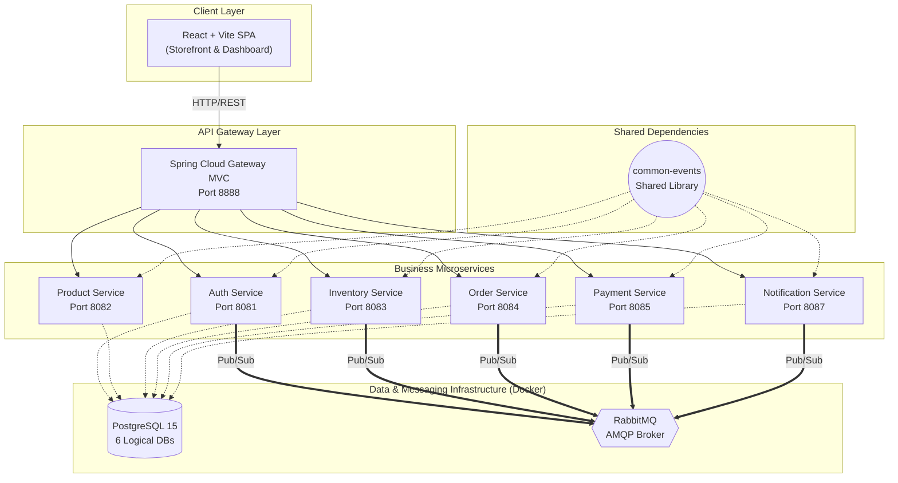
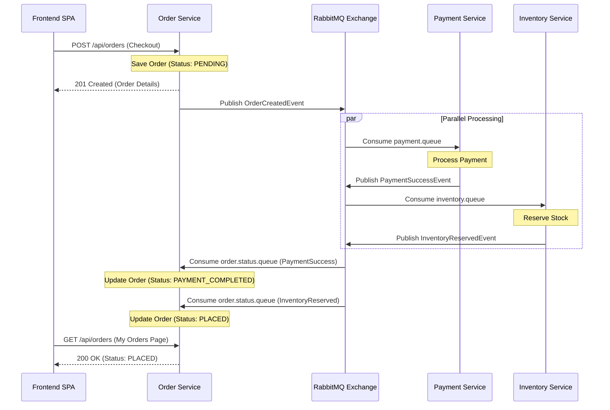

# AudioHub: Event-Driven Microservices E-Commerce Platform


**AudioHub** is a sophisticated, production-ready e-commerce platform built to handle high-volume retail transactions through a decoupled, microservices-based architecture. Designed with a custom "Audiophile Minimalism" aesthetic, the platform combines a highly responsive, animation-rich frontend with an enterprise-grade Spring Boot backend. 

By leveraging RabbitMQ for asynchronous saga orchestration and Spring Cloud Gateway for unified routing, AudioHub provides a highly resilient, scalable, and fault-tolerant foundation for digital commerce.

---

## 🌟 Key Features

### For Customers (Storefront)
*   **Immersive Product Discovery:** Products are presented using an "Editorial List" layout, utilizing GSAP (GreenSock) for tactile scroll physics and magnetic UI interactions.
*   **Psychological Commerce Triggers:** Includes live viewer counts and "Vault Status" scarcity warnings when inventory drops below 10 units, driving urgency.
*   **Dynamic Cart & Checkout:** Persistent Cart allows for uninterrupted shopping. The checkout flow orchestrates a complex, asynchronous microservice saga in the background while keeping the UI responsive.
*   **Order Tracking:** A dedicated interface allows users to view real-time order statuses (Pending, Placed, Cancelled) as they are processed by the backend message brokers.

### For Administrators (Dashboard)
*   **Complete Business Oversight:** Real-time analytics and metrics for recent orders, revenue, and active users.
*   **Dynamic Data Tables:** 7 distinct administrative tables featuring framer-motion powered expandable rows, allowing admins to dive deep into data without navigating away or losing context.
*   **Fully Responsive Admin Tools:** The dashboard gracefully scales to mobile dimensions by hiding non-critical columns and moving them into expandable detail panes.

---

## 🏗️ Platform Architecture 

The system follows a strict microservices pattern, ensuring isolation of concerns and independent scalability. Every service maintains its own logical database.



---

## 🔄 Asynchronous Messaging (RabbitMQ Saga)

At the heart of AudioHub's reliability is its event-driven choreography via RabbitMQ (AMQP). The checkout flow implements a complex **saga pattern** to guarantee data consistency across distributed services.



1. **Creation:** The user submits a checkout form. The `order-service` creates a `PENDING` order and publishes an `OrderCreatedEvent` to the `ecommerce.exchange`.
2. **Parallel Processing:** 
   * The `payment-service` consumes the event, processes the payment, and publishes a `PaymentSuccessEvent`.
   * The `inventory-service` consumes the event, reduces stock, and publishes an `InventoryReservedEvent`.
3. **Resolution:** The `order-service` utilizes an `OrderStatusListener`. As it receives the success events from payment and inventory, it transitions the order from `PENDING` to `PLACED`.
4. **Failure Handling:** If inventory is insufficient, the `inventory-service` emits an `InventoryFailedEvent`, which the `order-service` catches to transition the order to `CANCELLED`, automatically reversing the saga.

---

## 💻 Tech Stack

### Backend
*   **Java 21** & **Spring Boot 3.4**
*   **Spring Cloud Gateway MVC** (API Gateway)
*   **Spring Security & JWT** (Authentication)
*   **RabbitMQ** (Message Broker / Event Bus)
*   **PostgreSQL 15** (Relational Database)
*   **Maven** (Build Tool)

### Frontend
*   **React 19** & **Vite 6**
*   **Tailwind CSS v4** & **shadcn/ui** (Styling)
*   **Zustand** (Client State) & **React Query** (Server State)
*   **Framer Motion** & **GSAP** (Animations)

---

## 🚀 Getting Started (How to Run)

This project uses **Docker** to easily package all databases and services. You can get this entire microservices ecosystem running on your computer in minutes!

### Prerequisites
1. [Git](https://git-scm.com/downloads)
2. [Docker Desktop](https://www.docker.com/products/docker-desktop/) (Must be running in the background)
3. [Node.js (LTS)](https://nodejs.org/)

### 1. Download the Code
Open your terminal and clone the repository:
```bash
git clone https://github.com/YOUR_GITHUB_USERNAME/Event-Driven-Microservices-Based-Ecommerce-Backend-With-Dashboard.git
cd Event-Driven-Microservices-Based-Ecommerce-Backend-With-Dashboard
```

### 2. Start the Backend Ecosystem
With Docker Desktop running, spin up all 6 microservices, RabbitMQ, and PostgreSQL automatically:
```bash
docker-compose up --build -d
```
*Wait about 2-3 minutes for the containers to build and initialize.*

### 3. Start the Frontend Website
Open a **new** terminal window and move into the frontend folder:
```bash
cd frontend
npm install
npm run dev
```

### 4. Explore the Platform!
Open your web browser and go to:
**http://localhost:5173**

You can log in to the admin dashboard using these default credentials:
- **Email:** admin@audiohub.com
- **Password:** admin123

To shut down the backend services when you are finished, run:
```bash
docker-compose down
```
