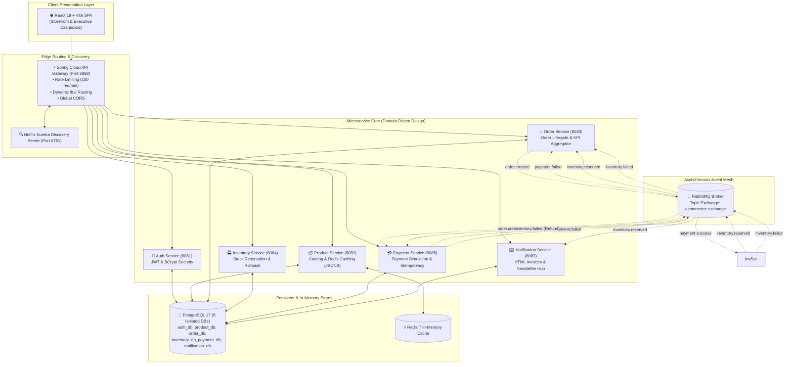
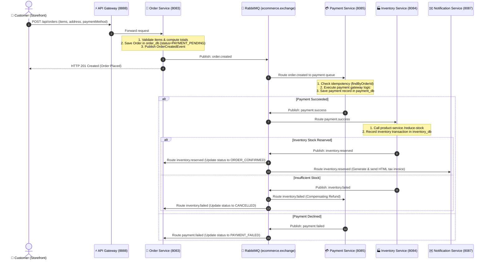

# 🎧 AudioHub: Event-Driven Microservices E-Commerce Platform & Executive Dashboard

[](https://openjdk.org/)
[](https://spring.io/projects/spring-boot)
[](https://spring.io/projects/spring-cloud)
[](https://www.rabbitmq.com/)
[](https://redis.io/)
[](https://cloud.spring.io/spring-cloud-netflix/)
[](https://www.postgresql.org/)
[](https://react.dev/)
[](https://tailwindcss.com/)
[](https://www.docker.com/)

**AudioHub** is an enterprise-grade, event-driven e-commerce platform and executive management dashboard designed for audiophile equipment (Headphones, IEMs, Studio Monitors, Tube DACs, Soundbars).

The architecture features a **Choreographed Distributed Saga** over **RabbitMQ**, **Netflix Eureka** dynamic service discovery, **Spring Cloud API Gateway** with token-bucket rate limiting and CORS, **PostgreSQL 17** with native `JSONB` mappings, **Redis** distributed caching, and a responsive dark-theme storefront and admin console built with **React 19**, **Tailwind CSS v4**, and **TanStack React Query**.

---

## 📑 Table of Contents
- [🌟 Key Architectural Highlights](#-key-architectural-highlights)
- [🏗️ System Architecture (HLD)](#️-system-architecture-hld)
- [🔄 Distributed Saga Execution Flow](#-distributed-saga-execution-flow)
- [⚙️ Microservices Ecosystem & Port Mapping](#️-microservices-ecosystem--port-mapping)
- [🚀 Quickstart & Setup Guide](#-quickstart--setup-guide)
- [🛡️ Security, Secrets & 12-Factor Configuration](#️-security-secrets--12-factor-configuration)
- [📖 API Documentation & Swagger UI](#-api-documentation--swagger-ui)
- [🧪 Running Unit Tests](#-running-unit-tests)
- [⚡ Performance Tuning & Optimization](#-performance-tuning--optimization)

---

## 🌟 Key Architectural Highlights

- **Event-Driven Saga Pattern (RabbitMQ):** Asynchronous order fulfillment across isolated database boundaries (`order_db`, `inventory_db`, `payment_db`, `notification_db`) with automatic compensating transactions (stock restore on payment failures).
- **Service Discovery & Dynamic Routing:** Netflix Eureka registry automatically binds service instances with `lb://` URI schemes and health heartbeats.
- **Edge API Gateway (Spring Cloud Gateway MVC):**
  - **Bucket4j Rate Limiting:** Enforces 100 requests/minute per client IP to safeguard downstream microservices.
  - **Centralized Security & CORS:** Global filter permitting Vite React client with credentials.
- **PostgreSQL JSONB Product Modeling:** Stores rich technical specifications, features, highlights, and box contents inside native `jsonb` columns using Hibernate 6 `@JdbcTypeCode(SqlTypes.JSON)`.
- **Automated Catalog Seeder:** On startup, automatically seeds 22 verified audiophile products across 6 categories in ₹ INR with dark-background imagery if the database is empty.
- **HTML Tax Invoice & Notification Engine:** Resolves customer name and email from `auth-service` via REST, constructs branded HTML tax invoices, and dispatches them asynchronously with fallback logging.
- **Storefront Newsletter & Admin Subscriber Hub:** Public subscription form in the storefront footer wired to `notification-service` with active subscriber management in the Admin Dashboard.
- **Executive Analytics Dashboard:** Single-call SQL aggregator endpoint in `order-service` computing revenue KPIs, order status distribution, and daily sales trends in under 50ms.
- **Order Lifecycle & Admin Status Management:** Orders transition through discrete distributed saga phases (`PAYMENT_PENDING`, `ORDER_CONFIRMED`, `PAID`, `SHIPPED`, `DELIVERED`, `CANCELLED`). The admin management console presents color-coded Status Badges with distinct lifecycle triggers (`View Details`, `Mark COD as Paid`, `Cancel Order`), maintaining domain consistency and eliminating 403 CSRF issues.
- **Redis 2-Layer Cache-Aside:** In-memory caching on hot catalog lookups (`@Cacheable`) with immediate cache invalidation (`@CacheEvict`) on writes.

---

## 🏗️ System Architecture (HLD)



---

## 🔄 Distributed Saga Execution Flow



---

## ⚙️ Microservices Ecosystem & Port Mapping

| Microservice | Port | Key Responsibilities | Primary Technologies |
|---|---|---|---|
| **`discovery-server`** | `8761` | Service Registry & Instance Heartbeat Tracking | Spring Cloud Netflix Eureka Server |
| **`api-gateway`** | `8888` | Unified Entry, Rate Limiting, CORS, `lb://` Routing | Spring Cloud Gateway MVC, Bucket4j |
| **`auth-service`** | `8081` | User Registration, Login, JWT Token Issuance & Profile | Spring Security 6, JJWT, BCrypt, PostgreSQL |
| **`product-service`** | `8082` | Product Catalog, JSONB Specs, Redis Caching, Seeder | Spring Data JPA, Redis Cache, Hibernate JSONB |
| **`order-service`** | `8083` | Order Creation, State Machine, Dashboard KPI Aggregator | Spring Data JPA, RabbitMQ, EntityGraph, BatchSize |
| **`inventory-service`** | `8084` | Stock Reservation Engine & Compensating Rollbacks | Spring Data JPA, RabbitMQ Listener |
| **`payment-service`** | `8085` | Payment Simulation & Idempotent Transaction Tracking | Spring Data JPA, RabbitMQ Event Listener |
| **`notification-service`**| `8087` | HTML Invoices, Async Mail Dispatch, Newsletter Hub | Spring Boot Mail, JavaMailSender, @Async |
| **`common-events`** | N/A | Shared Cross-Service Event DTOs & Domain Enums | Java Library JAR Dependency |
| **`frontend`** | `5173` | React 19 Storefront & Executive Admin Dashboard | React 19, Tailwind CSS v4, Vite 8, React Query |

---

## 🚀 Quickstart & Setup Guide

### Prerequisites
- [Docker Desktop](https://www.docker.com/products/docker-desktop/) (v20+)
- [Node.js](https://nodejs.org/) (v18+) & `npm`
- [Git](https://git-scm.com/)

### 1. Clone the Repository
```bash
git clone https://github.com/YOUR_USERNAME/Event-Driven-Microservices-Based-Ecommerce-Backend-With-Dashboard.git
cd Event-Driven-Microservices-Based-Ecommerce-Backend-With-Dashboard
```

### 2. Configure Environment Variables
Copy the example environment template:
```bash
cp .env.example .env
```
*(Optional: Add your Google App Password to `.env` to test live email delivery; otherwise, the system will log emails gracefully with zero disruption).*

### 3. Start the Backend Infrastructure
Spin up the entire microservices cluster, Redis, RabbitMQ, and PostgreSQL:
```bash
docker compose up -d --build
```
*Allow 1-2 minutes for initial container builds, database creation, and Eureka registration.*

Check container health:
```bash
docker compose ps
```

### 4. Start the Frontend Storefront & Admin Dashboard
Open a new terminal:
```bash
cd frontend
npm install
npm run dev
```

### 5. Access the Applications
- **Storefront & Admin UI:** [http://localhost:5173](http://localhost:5173)
- **API Gateway Root:** [http://localhost:8888](http://localhost:8888)
- **Eureka Service Registry:** [http://localhost:8761](http://localhost:8761)
- **RabbitMQ Management Dashboard:** [http://localhost:15672](http://localhost:15672) *(admin / admin)*

---

## 🛡️ Security, Secrets & 12-Factor Configuration

- **Zero Hardcoded Secrets**: All passwords, JWT keys, and SMTP credentials use property substitution `${VARIABLE_NAME:defaultValue}`.
- **Git-Ignored `.env`**: Actual secret keys reside in a local `.env` file that is excluded from Git via `.gitignore`.
- **Public `.env.example`**: A safe template file is committed to source control for developer onboarding.
- **Stateless JWT Security**: Passwords hashed with BCrypt (10 rounds); tokens digitally signed using HMAC-SHA256.

---

## 📖 API Documentation & Swagger UI

Each microservice is equipped with **SpringDoc OpenAPI 3** interactive documentation:

| Service | Swagger UI URL | OpenAPI JSON Spec |
|---|---|---|
| **Auth Service** | [http://localhost:8081/swagger-ui.html](http://localhost:8081/swagger-ui.html) | [http://localhost:8081/v3/api-docs](http://localhost:8081/v3/api-docs) |
| **Product Service** | [http://localhost:8082/swagger-ui.html](http://localhost:8082/swagger-ui.html) | [http://localhost:8082/v3/api-docs](http://localhost:8082/v3/api-docs) |
| **Order Service** | [http://localhost:8083/swagger-ui.html](http://localhost:8083/swagger-ui.html) | [http://localhost:8083/v3/api-docs](http://localhost:8083/v3/api-docs) |
| **Inventory Service**| [http://localhost:8084/swagger-ui.html](http://localhost:8084/swagger-ui.html) | [http://localhost:8084/v3/api-docs](http://localhost:8084/v3/api-docs) |
| **Payment Service** | [http://localhost:8085/swagger-ui.html](http://localhost:8085/swagger-ui.html) | [http://localhost:8085/v3/api-docs](http://localhost:8085/v3/api-docs) |
| **Notification Service** | [http://localhost:8087/swagger-ui.html](http://localhost:8087/swagger-ui.html) | [http://localhost:8087/v3/api-docs](http://localhost:8087/v3/api-docs) |

---

## 🧪 Running Unit Tests

Each service contains comprehensive **JUnit 5** and **Mockito** unit tests covering domain logic, validation constraints, and service layer behaviors:

```bash
# Auth Service Tests
cd backend/auth-service && ./mvnw test

# Product Service Tests
cd backend/product-service && ./mvnw test

# Order Service Tests
cd backend/order-service && ./mvnw test

# Inventory Service Tests
cd backend/inventory-service && ./mvnw test

# Payment Service Tests
cd backend/payment-service && ./mvnw test
```

---

## ⚡ Performance Tuning & Optimization

1. **N+1 Query Elimination:** `OrderRepository` uses explicit JPQL `JOIN FETCH`, `@EntityGraph`, and `@BatchSize(size = 50)` on line items to eliminate round-trip query storms.
2. **Tomcat Thread Tuning:** Worker threads capped at `server.tomcat.threads.max=20` to reduce JVM stack memory footprint across the 6 services.
3. **HikariCP Connection Pools:** Limited to `maximum-pool-size=5` per service to conserve PostgreSQL database handles.
4. **G1GC & String Deduplication:** JVM arguments `-XX:+UseG1GC -XX:+UseStringDeduplication` reduce heap memory overhead.
5. **Redis Cache-Aside:** Product catalog lookups cached in Redis with instant `@CacheEvict` invalidation on writes.

---